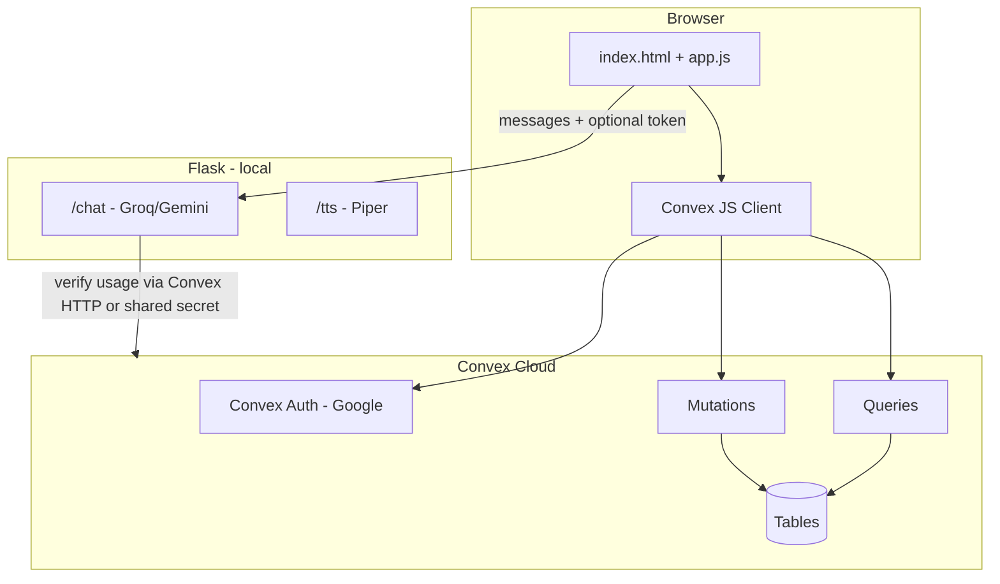
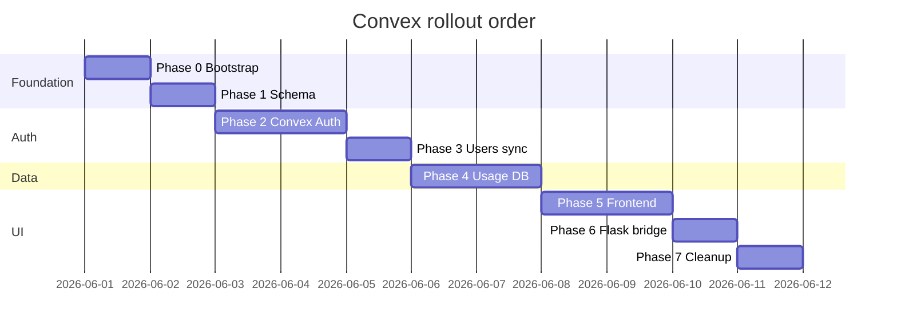

# Convex Backend Architecture — Phased Implementation

**Project:** WakuWaku AI Companion  
**Complexity:** Level 3  
**Target:** Login (Google) + database (users, usage, optional chat) on Convex  
**Keep on Flask (for now):** Groq chat, Piper TTS, static UI shell

---

## 1. Target architecture



### Responsibility split

| Concern | Owner | Why |
|---------|--------|-----|
| Google sign-in / sessions | **Convex Auth** | Built-in OAuth, JWT, no Flask session cookies for identity |
| `users` profile row | **Convex DB** | Single source of truth for `googleSub`, email, name, avatar |
| Daily 10-msg limit + rate limit | **Convex DB + mutations** | Replaces `data/daily_usage.json` |
| Chat messages (optional) | **Convex DB** | History per `sessionId`; can defer to Phase 4+ |
| LLM + TTS | **Flask** | Secrets stay server-side; Piper is local files |

### Recommended auth path
**Convex Auth with Google provider** (not Flask OAuth long-term).  
During migration, Flask may temporarily trust Convex-issued identity via HTTP action or signed token on `/chat`.

---

## 2. Data model (Phase 1)

### Table: `users`
| Field | Type | Notes |
|-------|------|--------|
| `_id` | `Id<"users">` | Convex id |
| `tokenIdentifier` | `string` | From Convex Auth (unique) |
| `googleSub` | `string` | OIDC `sub` |
| `email` | `string` | |
| `name` | `string` | |
| `picture` | `optional string` | |
| `createdAt` | `number` | ms timestamp |
| `lastLoginAt` | `number` | |

**Index:** `by_token`, `by_googleSub`

### Table: `dailyUsage`
| Field | Type | Notes |
|-------|------|--------|
| `userId` | `Id<"users">` | |
| `date` | `string` | `YYYY-MM-DD` UTC or local policy |
| `messageCount` | `number` | |
| `updatedAt` | `number` | |

**Index:** `by_user_date` (`userId`, `date`) — unique compound

### Table: `rateLimitEvents` (optional, or in-memory on mutation)
| Field | Type | Notes |
|-------|------|--------|
| `userId` | `Id<"users">` | |
| `timestamps` | `number[]` | last 60s, pruned in mutation |

*Alternative:* implement rate limit inside `incrementUsage` mutation with sliding window in `dailyUsage` or a small `rateBuckets` table.

### Table: `chatSessions` (optional — Phase 4b)
| Field | Type | Notes |
|-------|------|--------|
| `userId` | `Id<"users">` | |
| `clientSessionId` | `string` | from frontend `session_id` |
| `language` | `string` | `en` / `ja` |
| `updatedAt` | `number` | |

### Table: `chatMessages` (optional)
| Field | Type | Notes |
|-------|------|--------|
| `sessionId` | `Id<"chatSessions">` | |
| `role` | `"user" \| "assistant"` | |
| `content` | `string` | |
| `createdAt` | `number` | |

---

## 3. API surface (Convex functions)

### Queries (public, auth-required)
| Function | Returns | Used by |
|----------|---------|---------|
| `users.me` | current user profile | Sidebar, `/auth/me` replacement |
| `usage.status` | `{ limit, used, remaining, allowed, canSend }` | Usage meter |
| `usage.rateLimitStatus` | retry seconds | Chat guard |

### Mutations (auth-required)
| Function | Behavior |
|----------|----------|
| `users.upsertFromAuth` | Called after login; create/update user row |
| `usage.increment` | Atomic: check limit 10/day, rate limits, increment |
| `auth.logout` | Client-side Convex signOut (no server mutation) |

### HTTP actions (for Flask bridge — Phase 6)
| Action | Purpose |
|--------|---------|
| `usage.verifyAndIncrement` | Flask `/chat` sends Bearer token; Convex validates + increments |

*Prefer eventually:* browser calls `usage.increment` before/alongside chat, Flask only does AI.

---

## 4. Phased implementation

### Phase 0 — Bootstrap Convex project
**Goal:** Empty Convex app linked to repo.

**Steps:**
1. `npm install convex` (root or new `web/` — recommend **repo root** next to `package.json`).
2. `npx convex dev` → create project on convex.dev.
3. Add env:
   - `.env.local` (Convex): `CONVEX_DEPLOYMENT`, `CONVEX_URL`
   - `.env`: `CONVEX_URL` for Flask if needed
4. Folder layout:
   ```
   convex/
     schema.ts
     auth.ts          # Convex Auth config
     users.ts
     usage.ts
     http.ts          # optional HTTP router
   ```
5. Add `convex/_generated/` to gitignore (if not already).

**Exit criteria:** `npx convex dev` runs; dashboard shows deployment.

---

### Phase 1 — Schema & data model
**Goal:** Tables + indexes deployed.

**Steps:**
1. Define `schema.ts` with `users`, `dailyUsage` (and optional chat tables stubbed).
2. Deploy schema: `npx convex deploy` (dev auto via `convex dev`).
3. Document constants: `DAILY_MESSAGE_LIMIT = 10`, rate limits matching `usage_limit.py`.

**Exit criteria:** Schema visible in Convex dashboard; no functions yet.

---

### Phase 2 — Convex Auth (Google login)
**Goal:** Replace Flask OAuth as source of truth.

**Steps:**
1. Install `@convex-dev/auth` (or current Convex Auth package per docs).
2. Configure Google provider:
   - Same redirect URLs as today: `http://127.0.0.1:5000` — **note:** Convex Auth may use Convex-hosted callback; adjust OAuth client URIs per Convex docs.
3. `convex/auth.ts`: providers `[Google]`.
4. Set Convex env vars in dashboard:
   - `AUTH_GOOGLE_ID`
   - `AUTH_GOOGLE_SECRET`
5. Remove duplicate secrets from Flask `.env` only after cutover (keep during migration).

**Exit criteria:** Test user can sign in via Convex Auth in dashboard playground or minimal test page.

**Risk:** Redirect URI mismatch — update Google Cloud OAuth client to include Convex callback URLs.

---

### Phase 3 — User records sync
**Goal:** Every authenticated identity has a `users` row.

**Steps:**
1. Mutation `users.upsertFromAuth`:
   - Read `ctx.auth.getUserIdentity()`
   - Insert or patch by `tokenIdentifier` / `googleSub`
2. Query `users.me` for profile fields.
3. Hook: run upsert on first authenticated query/mutation (or auth callback).

**Exit criteria:** After Google login, `users` table has one row; `users.me` returns name/email/picture.

---

### Phase 4 — Usage limits & rate limits in Convex
**Goal:** Replace `data/daily_usage.json` and `usage_limit.py` logic.

**Steps:**
1. Port logic from `usage_limit.py`:
   - `DAILY_MESSAGE_LIMIT = 10`
   - `CHAT_RATE_MAX_REQUESTS = 8` / 60s window
   - `CHAT_RATE_MIN_INTERVAL_SECONDS = 2`
2. Mutation `usage.increment`:
   - Require auth
   - Load/create `dailyUsage` for `today` + `userId`
   - Enforce limits; return new status
3. Query `usage.status` (read-only, no increment).
4. Stop writing `daily_usage.json` (feature flag `USE_CONVEX_USAGE=true`).

**Exit criteria:** Authenticated user sees correct remaining count; 11th message rejected in Convex.

---

### Phase 5 — Frontend Convex client
**Goal:** `static/app.js` uses Convex for auth + usage.

**Steps:**
1. Bundle Convex browser client (esbuild/vite **or** ESM import map — minimal: add build step to `package.json`).
2. Init client with `CONVEX_URL` injected in `index.html` from Flask template or `window.__ENV__`.
3. Replace:
   - `fetch('/auth/me')` → `useQuery(api.users.me)` or equivalent vanilla subscribe
   - `fetch('/usage/status')` → `usage.status`
   - Google button → Convex Auth `signIn("google")`
   - Logout → `signOut()`
4. Update UI states in `renderAuth()` / `refreshUsage()`.

**Exit criteria:** App works without Flask `/auth/*` for read paths; sign-in/out functional.

**Design note:** Verify auth sidebar + usage meter after wiring (see `DESIGN.md`).

---

### Phase 6 — Flask bridge for `/chat`
**Goal:** Chat still works; usage enforced consistently.

**Option A (recommended for fun project):**  
Browser calls `usage.increment` **before** `POST /chat`. Flask trusts nothing on usage (or double-checks with Convex HTTP action).

**Option B:**  
Flask `/chat` calls Convex HTTP action with service token to increment atomically with AI call.

**Steps:**
1. Require `user_is_authenticated` equivalent: verify Convex JWT in Flask **or** only allow chat when frontend passes short-lived token (harder).
2. Simpler path: keep Flask check `session` until Phase 5 complete, then pass Convex session cookie — **migrate Flask auth last**.

**Exit criteria:** End-to-end: login → usage meter → chat → 10/day enforced.

---

### Phase 7 — Cleanup & hardening
**Goal:** Remove legacy paths.

**Steps:**
1. Delete or archive `auth.py` OAuth routes (if fully on Convex Auth).
2. Remove `usage_limit.py` + `data/daily_usage.json` usage.
3. Update README, `.env.example` with Convex vars.
4. Playwright: sign-in flow may need test account / mock Convex.
5. Security review: all mutations use `ctx.auth`; no public `increment` without auth.

**Exit criteria:** Single auth path; no file-based usage store.

---

## 5. Environment variables (consolidated)

| Variable | Where | Purpose |
|----------|--------|---------|
| `GROQ_API_KEY` | Flask `.env` | Chat AI |
| `FLASK_SECRET_KEY` | Flask `.env` | Flask session (until Phase 7) |
| `CONVEX_URL` | Browser + optional Flask | Convex deployment URL |
| `AUTH_GOOGLE_ID` | Convex dashboard | OAuth |
| `AUTH_GOOGLE_SECRET` | Convex dashboard | OAuth |
| `GOOGLE_OAUTH_*` | Flask `.env` | **Remove after Phase 7** |

---

## 6. Migration strategy (risk order)



**Lowest risk order:** Schema → Auth → Users → Usage → Frontend → Flask bridge → Delete legacy.

---

## 7. What stays on Flask (explicit)

| Endpoint | Stays? | Notes |
|----------|--------|-------|
| `POST /chat` | Yes | Groq/Gemini + Piper context |
| `POST /tts` | Yes | Local Piper |
| `GET /` | Yes | Serves template |
| `/auth/*` | No (after Phase 7) | Replaced by Convex Auth |
| `/usage/status` | No (after Phase 5) | Convex query |

---

## 8. Implementation order

| Step | Status |
|------|--------|
| Plan | Done — see `.cursor/memory-bank/tasks.md` (local) or PR list below |
| Build | Phase 1 done — branch `feat/convex-phase-1-schema` |
| Creative | Before Phase 5 — auth sidebar + usage meter |

### PR sequence (one PR per phase — merge before next)
| # | Branch |
|---|--------|
| 1 | `feat/convex-phase-0-init` |
| 2 | `feat/convex-phase-1-schema` |
| 3 | `feat/convex-phase-2-auth` |
| 4 | `feat/convex-phase-3-users` |
| 5 | `feat/convex-phase-4-usage` |
| 6 | `feat/convex-phase-5-frontend` |
| 7 | `feat/convex-phase-6-chat-bridge` |
| 8 | `chore/convex-phase-7-cleanup` |

Phase 5 UI decisions: dual Google control (`data-auth-backend`), Convex usage subscription — documented in project creative notes (local `.cursor/memory-bank/creative/`).

---

## 9. Pre-commit phase gate (every phase)

Before committing each phase PR, run **audit → verify → optimize → cleanup**:

```bash
npm run phase:gate -- 0   # replace 0 with current phase number
```

Full checklist: [docs/PHASE_GATE.md](docs/PHASE_GATE.md)  
**UI phases (5, 7):** must pass `npm run test:a11y`.  
**Rule:** Do not merge/commit until `phase:gate` exits 0.

---

## 10. Decisions needed

1. **Convex Auth only** vs. keep Flask Google OAuth and sync users? → Recommend **Convex Auth only**.
2. **Store chat history in Convex?** → Optional Phase 4b.
3. **Add Vite** for bundling Convex client vs. esbuild in `package.json`? → esbuild is enough for vanilla JS.
